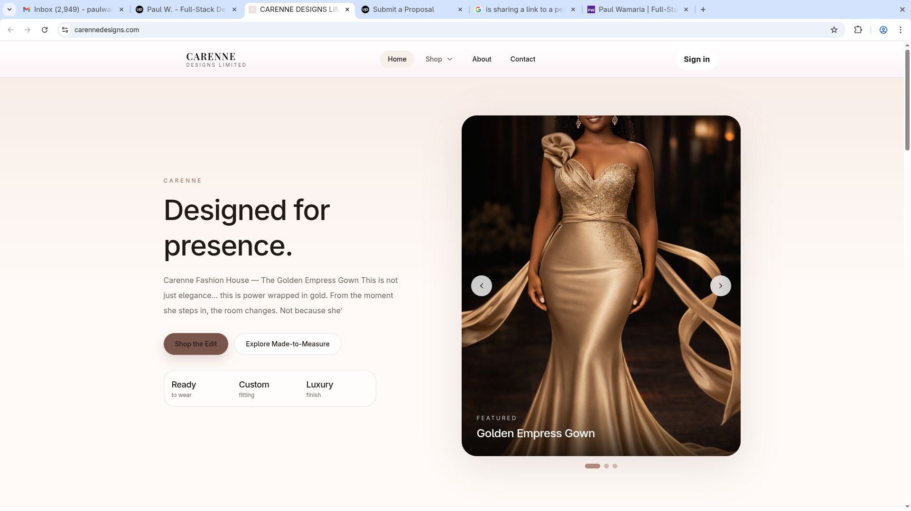
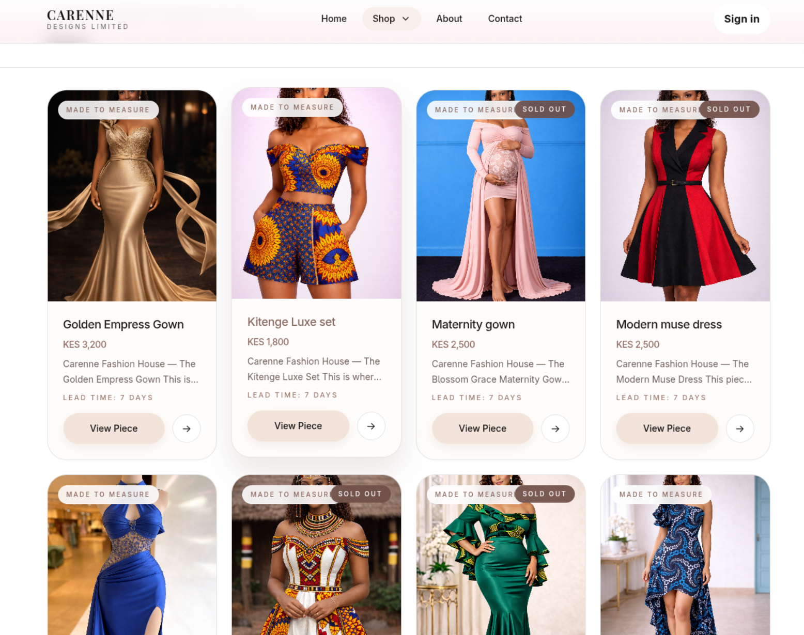

# Carenne Fashion House ✨

A luxury fashion e-commerce platform designed to deliver a refined digital shopping experience while supporting scalable product management and business workflows.

Carenne combines **elegant UI design** with **robust full-stack architecture**, built to reflect a modern, high-end fashion brand.

> 🔒 The full source code is private due to active development and business considerations.  
> I’m happy to walk through the system, architecture, or provide access upon request.

---

## 🚀 Overview

Carenne was built to solve a common gap in fashion e-commerce:  
how to present products in a **visually premium way** while maintaining a **structured, scalable backend system**.

The platform supports both **ready-to-wear** and **made-to-measure workflows**, enabling flexibility for modern fashion operations.

---

## 🎬 Demo (Coming Soon)

<p align="center">
  
</p>

> A walkthrough showcasing product browsing, layout transitions, and the overall shopping experience.

---

## 📸 Screenshots

### Landing Page

<p align="center">
  
</p>

### Product Display

<p align="center">
  
</p>

### Product Detail

<p align="center">
  
</p>

---

## 🧰 Tech Stack

### Frontend
- Next.js
- React
- TypeScript
- Tailwind CSS

### Backend
- Django
- Django REST Framework

### Database
- PostgreSQL

### Infrastructure
- Docker
- Render (Backend)
- Vercel / Netlify (Frontend)

---

## 🔥 Key Features

- Elegant, brand-focused storefront design
- Dynamic product catalog
- Ready-to-wear and made-to-measure support
- Reservation / inquiry workflow
- Admin-friendly product management
- Responsive UI across devices
- API-driven architecture

---

## 🧠 Architecture Overview

- **Frontend:** Next.js (App Router, server + client components)
- **Backend:** Django REST API
- **Database:** PostgreSQL (relational data modeling)
- **Media Handling:** Structured product image management
- **Data Flow:** Client → API → Database

The system is designed with **separation of concerns**, allowing independent scaling of frontend and backend services.

---

## 🎯 Design Approach

Carenne focuses heavily on **presentation and perception**:

- Minimalist layout with strong visual hierarchy
- Emphasis on product imagery
- Smooth browsing experience
- Clean typography and spacing

The goal was to create a **luxury digital experience**, not just a functional store.

---

## ⚙️ Deployment

- **Backend:** Render
- **Frontend:** Vercel / Netlify
- **Database:** PostgreSQL (managed)

---

## 🌍 Live Preview

```text
https://carennedesigns.com

## 🔐 Source Code Access

The full source code for Carenne is private due to active development and business considerations.

If you’re a recruiter, hiring manager, or collaborator and would like to review the codebase, you can request access below:

👉 **Request Access:**  
mailto:paulwamaria@gmail.com?subject=Carenne%20Source%20Code%20Request&body=Hi%20Paul,%0A%0AI'd%20like%20to%20request%20access%20to%20the%20Carenne%20repository.%0A%0AName:%0ACompany:%0APurpose:%0A%0AThanks!

---

I can also provide:
- A guided walkthrough of the architecture
- Screenshare demo of the codebase
- Technical discussion on design decisions